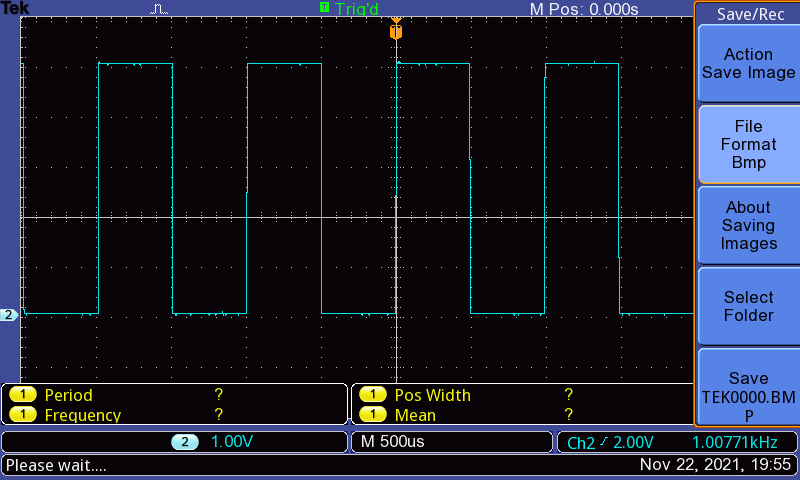
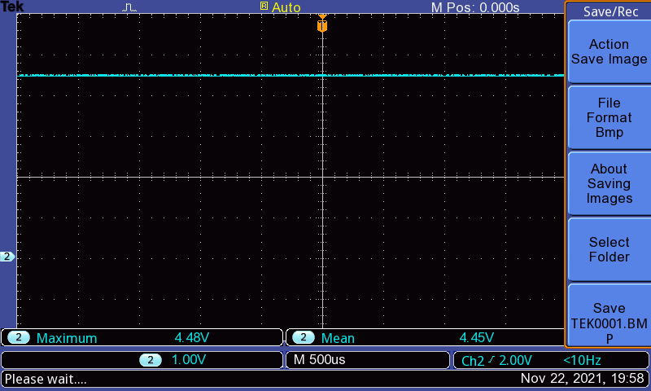
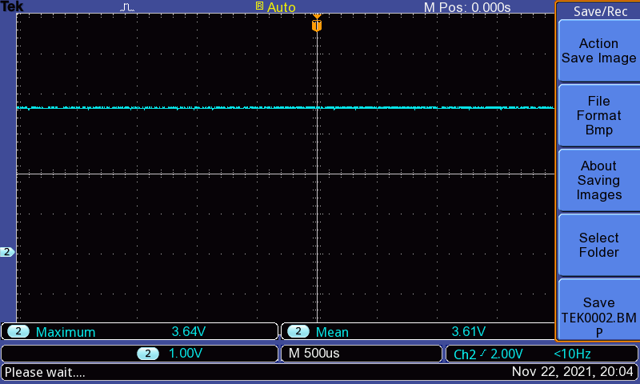
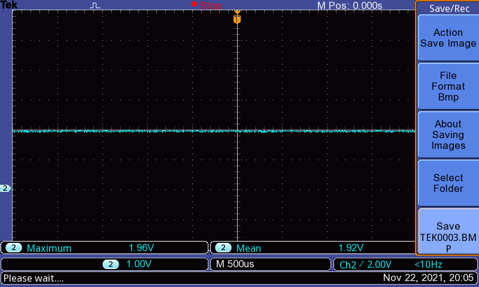

# Compte Rendu Prise en main Oscilloscope

## 1. Réglages préliminaires

Sur l'oscilloscope, il y a une borne de calibration pour pouvoir vérifier le bon fonctionnement et réglages des sondes.

On peut bien voir sur l'image le signal carré de 1kHz 5V p-p.
Il fallait un peur régler le condensateur de la sonde pour avoir un beau signal carré.

## 2.Mesure de tensions continues

Tension 5V

Tension 3.3V

