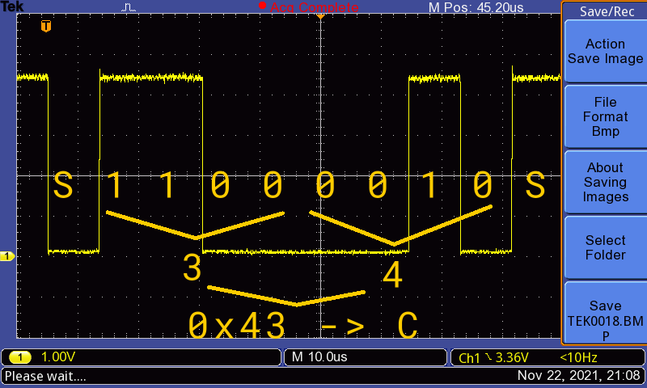

# Compte Rendu Prise en Main Oscilloscope

## 1. Réglages préliminaires

Sur l'oscilloscope, il y a une borne de calibration pour pouvoir vérifier le bon fonctionnement et réglages des sondes.

On peut bien voir sur l'image le signal carré de 1kHz 5V p-p.
Il fallait un peur régler le condensateur de la sonde pour avoir un beau signal carré.

## 2.Mesure de tensions continues

Tension 5V

Tension 3.3V

Tension aux bornes de la led rouge.

## 3. Mesures de signaux périodique

#### Blink

Après avoir modifié Blink.ino, on a mesuré la tension aux bornes de la led rouge.

On peut voir sur la chaine 1 (en jaune, 50 ms/div, 500 mV/div) que le signal de la led rouge agis comme attendu, avec une période de 200 ms (illumination de 100 ms)

#### PWM

On a mesuré les leds bleu (chaine 2, bleu) et rouge (chaine 1, jaune):

Le signal led rouge à un rapport cyclique de 26% (260/1000)
Le signal led blueu à un rapport cyclique de 10% (200/2000)

La led verte ne reste allumée que 12 µs, ce qui lui donne un rapport cyclique de 1.2%.

#### Serial

On a relevé le signal sur la broche TX.

Il s'agit d'un signal RS232. chaque bit à environ une durée de 104 µs, ce quit donne une valeure pratique de 9615 bits/s.

Le prof à intelligeament choisis le charactère 'U', pour que le signal est cette tronche, pour perturber les étidiants.

(Sachant qu'il y a un bit de start et stop, et LSB first: on peut lire 0x55, ce qui correspond en effet à 'U')

C'est un 'A'.

## 4. Mesures de durées d'exécution

Mesure pour v=4*t+5

Mesure pour v=4.0*t+5.0

Mesure pour v=4.0*t+5

Mesure pour v=4*t+5.0

On peux en conclure que le float est plus long que l'integer.

## 6. Captures d'éventements fugitifs

Signal du caractère C

La conversion du signal en binaire est 0100 0011 soit le caractère C en ASCII.
